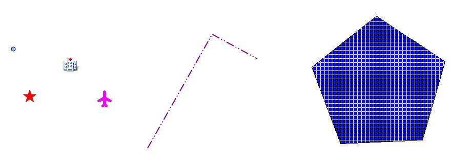
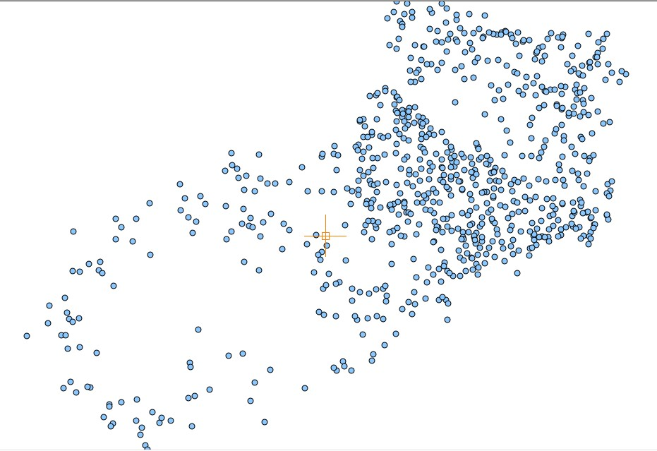
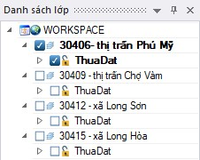

#  I. Các khái niệm cơ bản
<!-- ##  I. Các khái niệm cơ bản -->
## I.1	Đối tượng hình học không gian :
Các đối tượng thực tế được thể hiện trên bản đồ số thông qua các đối tượng hình học cơ bản: **điểm, đường, vùng.**

Đối tượng điểm (point): Là đối tượng thực tế được quản lý thông qua một tọa độ duy nhất trên bản đồ số mà người dùng thường không quan tâm đến kích thước của nó. 
Tùy theo yêu cầu sử dụng mà đối tượng điểm có thể được hiển thị trên bản đồ với những biểu tượng khác nhau.

## I.2 Danh mục (Catalog)
Trong VIETBANDO DESKTOP, bạn làm việc trên một WorkSpace. Một WorkSpace sẽ chứa nhiều danh mục (Catalog) và chỉ làm việc trên một danh mục đang hoạt động. Các danh mục sẽ chứa các lớp (layer) bản đồ riêng biệt. Các danh mục đã tạo ra có thể điều chỉnh bằng nhiều cách khác nhau, thêm, xóa, sửa hoặc xắp xếp lại chúng sao cho hợp lý nhất.

Ví dụ: danh mục thứ nhất chứa các quận huyện của thành phố Hồ Chí Minh, danh mục thứ hai chứa các quận huyện của thủ đô Hà Nội… Các danh mục sẽ xây dựng một bản đồ hoàn chỉnh của Việt Nam. Bạn chỉ có thể hiển thị một danh mục cùng một thời điểm.

## I.3 Danh mục hiện hành (được kích hoạt) :

Mỗi phiên làm việc trên dữ liệu chỉ làm việc trên một danh mục được kích hoạt. Trong file *.vdf có thể có nhiều danh mục nhưng ứng dụng chỉ hiện thị lên màn hình dữ liệu của danh mục hiện hành đang được kích hoạt để biên tập.

## I.4.	Lớp (Layer) :
Trong VIETBANDO DESKTOP, bạn bắt đầu mở bảng dữ liệu của bạn và hiển thị nó trong Data Window. Mỗi bảng dữ liệu sẽ hiển thị như là một lớp bản đồ riêng biệt. Mỗi layer đang hoạt động sẽ kèm theo bảng của nó đi kèm, trong layer có đối tượng hình học thì bên bảng cũng có đối tượng phi hình học đi kèm như khu vực, điểm, đường thẳng, vùng riêng biệt. Ngoài ra, lớp còn chứa các đặc điểm chồng lên nhau. Các lớp bản đồ xây dựng nên bản đồ hoàn chỉnh. Một khi bạn đã tạo ra các lớp của bạn, bạn có thể điều chỉnh chúng bằng nhiều cách khác nhau, thêm và xóa, hoặc xắp xếp lại chúng sao cho hợp lý nhất.