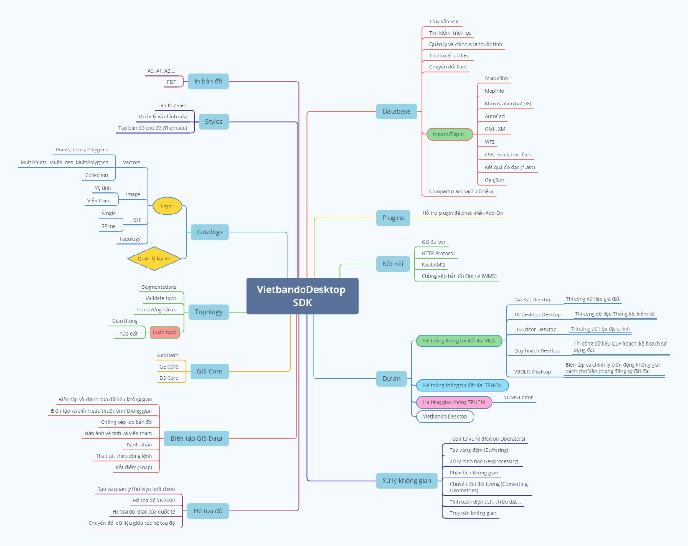

# Giới thiệu

    TÀI LIỆU HƯỚNG DẪN SỬ DỤNG PHẦN MỀM BIÊN TẬP DỮ LIỆU BẢN ĐỒ VIETBANDO DESKTOP

VIETBANDO DESKTOP là một phần mềm biên tập, chỉnh sửa và hiển thị dữ liệu bản đồ một cách hoàn thiện trên máy tính cá nhân. Có thể thực hiện các nhiệm vụ phân tích địa lý phức tạp, tạo các bản đồ chuyên đề trên các trường thuộc tính ở bên trong dữ liệu của bạn và nhiều tính năng mạnh mẽ khác như : Kết hợp và chia tách đối tượng, tạo vùng đệm và chuyển đổi (conversion) giữa các đối tượng vùng, đường điểm… Bạn có thể tương tác qua lại giữa đối tượng hình học và dữ liệu thuộc tính một cách trực quan.
Ngoài ra, người dùng có thể thực hiện các câu lệnh truy vấn dữ liệu thuộc tính (SQL Query) hoặc theo các ràng buộc của dữ liệu không gian (SQL Spatial), xây dựng các mạng lưới Topo hoặc phân đoạn cho các lớp dữ liệu đường. VIETBANDO DESKTOP giúp người dùng kiểm tra tính chính xác (Validate topology) của dữ liệu bản đồ bằng nhiều luật topo được xây dựng sẵn (32 luật).
Phần mềm cũng xây dựng sẵn các tập lệnh (command line) song song cùng với các menu chức năng để giúp người dùng thuận tiện trong các thao tác biên tập. Thêm nữa, công cụ cho phép bạn có thể tạo ra các lớp dữ liệu từ các nguồn dữ liệu về Geographic Information System khác : Shapefiles (*.shp), MapInfo (*.MIF), KML, DGN, WFS,… Và xuất ngược ra các định dạng khác : Shapefiles, MapInfo và GML.
Với Hệ Quy Chiếu và Hệ Tọa Độ, VIETBANDO DESKTOP cho phép người dùng xây dựng, chỉnh sửa và thiết lập các hệ quy chiếu và hệ tọa độ khác nhau : VN2000 (múi chiếu 3 và 6 độ theo kinh tuyến trục từng địa phương), WGS84,… Người dùng có thể sử dụng các hệ tọa độ từ thư viện được dựng sẵn hoặc có thể tạo một hệ tọa độ mới để phục vụ cho công việc biên tập bản đồ. Ngoài hệ tọa độ hiển thị chung cho tất cả các lớp dữ liệu (layers). Ứng dụng cho phép người dùng thiết lập các hệ tọa độ khác nhau cho mỗi lớp dữ liệu.
Tài liệu hướng dẫn này bao gốm tất cả các mô tả hướng dẫn chi tiết sử dụng các chức năng của phần mềm giúp người dùng có thể xây dựng một dữ liệu bản đồ hoàn chỉnh. Đi kèm với nó là công cụ xây dựng và quản lý các loại định dạng kiểu mẫu (styles) phù hợp cho từng loại đối tượng khác nhau từ thư viện tạo sẵn hoặc do người dùng thiết lập nên. 
## Sơ đồ

<!-- ## Mục lục
- [Tiêu đề 1](#tiêu-đề-1)
  - [Tiêu đề 2](#tiêu-đề-2)
    - [Tiêu đề 3](#tiêu-đề-3) -->
